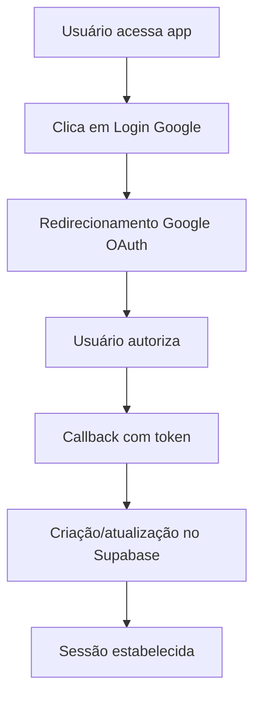
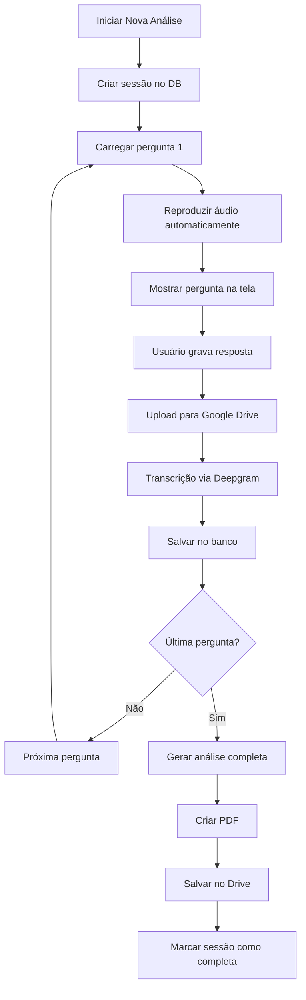
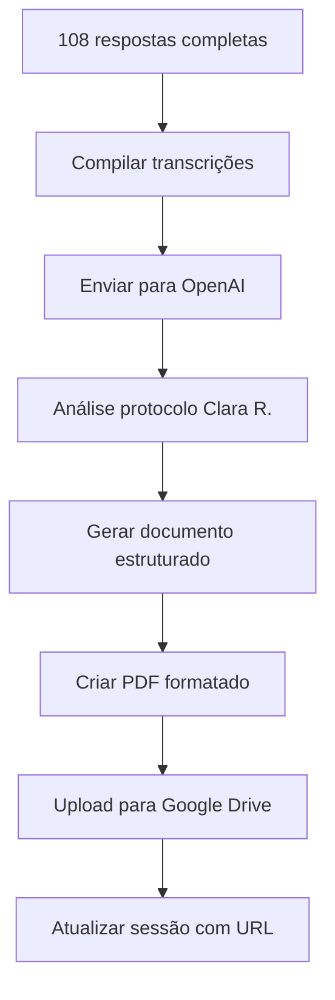

# Manual Completo de Implementação - DNA Platform
## Deep Narrative Analysis - Versão 3.0

---

## 📋 Índice

1. [Visão Geral do Sistema](#visão-geral-do-sistema)
2. [Arquitetura Técnica](#arquitetura-técnica)
3. [Configuração do Ambiente](#configuração-do-ambiente)
4. [Configuração dos Serviços](#configuração-dos-serviços)
5. [Estrutura do Banco de Dados](#estrutura-do-banco-de-dados)
6. [Estrutura do Código](#estrutura-do-código)
7. [Fluxo de Funcionamento](#fluxo-de-funcionamento)
8. [Deploy e Produção](#deploy-e-produção)
9. [Monitoramento e Manutenção](#monitoramento-e-manutenção)
10. [Troubleshooting](#troubleshooting)

---

## 🎯 Visão Geral do Sistema

### Objetivo
O **DNA Platform** é uma aplicação SaaS para análise psicológica profunda baseada no protocolo Clara R., que utiliza 108 perguntas estratégicas distribuídas em 9 domínios fundamentais da personalidade humana.

### Funcionalidades Principais
- ✅ Autenticação segura via Google OAuth
- ✅ Reprodução automática de perguntas em áudio
- ✅ Gravação e transcrição automática de respostas
- ✅ Armazenamento seguro no Google Drive do administrador
- ✅ Análise psicológica completa via IA
- ✅ Geração automática de relatório PDF
- ✅ Dashboard com progresso individual
- ✅ Histórico de sessões pessoais

### Público-Alvo
- **Usuários Finais**: Pessoas interessadas em autoconhecimento
- **Administradores**: Profissionais que analisam os dados coletados

---

## 🏗️ Arquitetura Técnica

### Stack Tecnológico

#### Frontend
- **React 18** - Interface de usuário
- **TypeScript** - Tipagem estática
- **Tailwind CSS** - Estilização
- **Framer Motion** - Animações
- **Vite** - Build tool

#### Backend/Database
- **Supabase** - Backend-as-a-Service
- **PostgreSQL** - Banco de dados
- **Row Level Security (RLS)** - Segurança granular

#### Integrações Externas
- **Google OAuth** - Autenticação
- **Google Drive API** - Armazenamento de arquivos
- **Deepgram API** - Transcrição de voz
- **OpenAI API** - Análise psicológica

#### Deploy
- **Netlify** - Hospedagem e CI/CD
- **Vercel** - Alternativa de hospedagem

---

## ⚙️ Configuração do Ambiente

### 1. Pré-requisitos
```bash
# Node.js 18+ e npm
node --version  # v18.0.0+
npm --version   # 8.0.0+

# Git
git --version
```

### 2. Clonagem e Instalação
```bash
# Clonar repositório
git clone https://github.com/seu-usuario/dna-platform.git
cd dna-platform

# Instalar dependências
npm install

# Copiar arquivo de ambiente
cp .env.example .env
```

### 3. Variáveis de Ambiente
Edite o arquivo `.env` com suas credenciais:

```env
# Supabase Configuration
VITE_SUPABASE_URL=https://seu-projeto.supabase.co
VITE_SUPABASE_ANON_KEY=sua_chave_anonima_supabase

# OpenAI Configuration
VITE_OPENAI_API_KEY=sk-sua_chave_openai

# Google Drive API
VITE_GOOGLE_DRIVE_API_KEY=sua_chave_google_drive
VITE_GOOGLE_CLIENT_ID=seu_client_id_google

# Deepgram API
VITE_DEEPGRAM_API_KEY=sua_chave_deepgram

# Configurações de Ambiente
VITE_APP_ENV=development
VITE_APP_NAME=DNA Platform
VITE_APP_VERSION=1.0.0

# URLs de Áudio
VITE_AUDIO_BASE_URL=https://seu-projeto.supabase.co/storage/v1/object/public/dna-protocol-audio/

# Configurações de Análise
VITE_MAX_RECORDING_DURATION=300
VITE_MIN_RECORDING_DURATION=10
VITE_TOTAL_QUESTIONS=108
```

---

## 🔧 Configuração dos Serviços

### 1. Supabase Setup

#### 1.1 Criando o Projeto
1. Acesse [supabase.com](https://supabase.com)
2. Clique em "New Project"
3. Preencha:
   - **Name**: DNA Platform
   - **Database Password**: Senha forte (salve em local seguro)
   - **Region**: Mais próxima dos usuários
4. Aguarde criação (2-3 minutos)

#### 1.2 Obtendo Credenciais
1. Vá para **Settings > API**
2. Copie:
   - **Project URL** → `VITE_SUPABASE_URL`
   - **anon public** → `VITE_SUPABASE_ANON_KEY`

#### 1.3 Configurando Storage
1. Vá para **Storage**
2. Clique em "Create bucket"
3. Nome: `dna-protocol-audio`
4. Marque como **Public bucket**
5. Clique em "Create bucket"

### 2. Google Cloud Setup

#### 2.1 Criando Projeto
1. Acesse [console.cloud.google.com](https://console.cloud.google.com)
2. Clique em "New Project"
3. Nome: "DNA Platform"
4. Clique em "Create"

#### 2.2 Habilitando APIs
1. Vá para **APIs & Services > Library**
2. Habilite as seguintes APIs:
   - Google Drive API
   - Google OAuth2 API

#### 2.3 Configurando OAuth
1. Vá para **APIs & Services > Credentials**
2. Clique em "Create Credentials" > "OAuth client ID"
3. Configure:
   - **Application type**: Web application
   - **Name**: DNA Platform
   - **Authorized JavaScript origins**: 
     - `http://localhost:5173` (desenvolvimento)
     - `https://seu-app.netlify.app` (produção)
   - **Authorized redirect URIs**:
     - `http://localhost:5173/auth/callback`
     - `https://seu-app.netlify.app/auth/callback`
4. Copie:
   - **Client ID** → `VITE_GOOGLE_CLIENT_ID`
   - **Client Secret** → (usar no backend)

#### 2.4 Configurando Google Drive API
1. Vá para **APIs & Services > Credentials**
2. Clique em "Create Credentials" > "API key"
3. Copie a chave → `VITE_GOOGLE_DRIVE_API_KEY`
4. Clique em "Restrict Key"
5. Em **API restrictions**, selecione "Google Drive API"

### 3. Deepgram Setup

#### 3.1 Criando Conta
1. Acesse [deepgram.com](https://deepgram.com)
2. Clique em "Sign Up"
3. Complete o cadastro

#### 3.2 Obtendo API Key
1. Vá para **Console > API Keys**
2. Clique em "Create a New API Key"
3. Nome: "DNA Platform"
4. Copie a chave → `VITE_DEEPGRAM_API_KEY`

### 4. OpenAI Setup

#### 4.1 Criando Conta
1. Acesse [platform.openai.com](https://platform.openai.com)
2. Faça login ou crie conta

#### 4.2 Obtendo API Key
1. Vá para **API Keys**
2. Clique em "Create new secret key"
3. Nome: "DNA Platform"
4. Copie a chave → `VITE_OPENAI_API_KEY`

#### 4.3 Configurando Billing
1. Vá para **Billing**
2. Adicione método de pagamento
3. Configure limites de uso

---

## 🗄️ Estrutura do Banco de Dados

### Schema SQL Completo

Execute no **SQL Editor** do Supabase:

```sql
-- Habilitar extensões necessárias
CREATE EXTENSION IF NOT EXISTS "pgcrypto";

-- Tabela de usuários (estende auth.users)
CREATE TABLE users (
  id UUID PRIMARY KEY DEFAULT gen_random_uuid(),
  created_date TIMESTAMPTZ DEFAULT NOW(),
  email TEXT UNIQUE NOT NULL,
  full_name TEXT,
  avatar_url TEXT,
  last_login TIMESTAMPTZ,
  total_sessions INTEGER DEFAULT 0,
  completed_sessions INTEGER DEFAULT 0,
  total_responses INTEGER DEFAULT 0,
  total_audio_time INTEGER DEFAULT 0
);

-- Tabela de sessões de análise
CREATE TABLE analysis_sessions (
  id UUID PRIMARY KEY DEFAULT gen_random_uuid(),
  created_date TIMESTAMPTZ DEFAULT NOW(),
  user_email TEXT NOT NULL,
  status TEXT DEFAULT 'active' CHECK (status IN ('active', 'completed', 'paused')),
  current_question INTEGER DEFAULT 1,
  total_questions INTEGER DEFAULT 108,
  progress_percentage INTEGER DEFAULT 0,
  final_synthesis TEXT,
  pdf_file_url TEXT,
  drive_folder_id TEXT
);

-- Tabela de respostas dos usuários
CREATE TABLE user_responses (
  id UUID PRIMARY KEY DEFAULT gen_random_uuid(),
  created_date TIMESTAMPTZ DEFAULT NOW(),
  session_id UUID REFERENCES analysis_sessions(id) ON DELETE CASCADE,
  question_index INTEGER NOT NULL,
  question_text TEXT NOT NULL,
  question_domain TEXT NOT NULL,
  transcript_text TEXT,
  audio_duration NUMERIC,
  audio_file_url TEXT,
  drive_file_id TEXT,
  analysis_keywords TEXT[] DEFAULT '{}',
  sentiment_score NUMERIC,
  emotional_tone TEXT
);

-- Habilitar Row Level Security
ALTER TABLE users ENABLE ROW LEVEL SECURITY;
ALTER TABLE analysis_sessions ENABLE ROW LEVEL SECURITY;
ALTER TABLE user_responses ENABLE ROW LEVEL SECURITY;

-- Políticas de segurança para users
CREATE POLICY "Users can read own data" ON users
  FOR SELECT USING (auth.jwt() ->> 'email' = email);

CREATE POLICY "Users can update own data" ON users
  FOR UPDATE USING (auth.jwt() ->> 'email' = email);

-- Políticas de segurança para analysis_sessions
CREATE POLICY "Users can access own sessions" ON analysis_sessions
  FOR ALL USING (auth.jwt() ->> 'email' = user_email);

-- Políticas de segurança para user_responses
CREATE POLICY "Users can access own responses" ON user_responses
  FOR ALL USING (
    session_id IN (
      SELECT id FROM analysis_sessions 
      WHERE user_email = auth.jwt() ->> 'email'
    )
  );

-- Índices para performance
CREATE INDEX idx_analysis_sessions_user_email ON analysis_sessions(user_email);
CREATE INDEX idx_analysis_sessions_status ON analysis_sessions(status);
CREATE INDEX idx_user_responses_session_id ON user_responses(session_id);
CREATE INDEX idx_user_responses_question_index ON user_responses(question_index);
CREATE INDEX idx_users_email ON users(email);

-- Função para atualizar estatísticas do usuário
CREATE OR REPLACE FUNCTION update_user_stats()
RETURNS TRIGGER AS $$
BEGIN
  -- Atualizar estatísticas quando uma resposta é inserida
  IF TG_OP = 'INSERT' THEN
    UPDATE users 
    SET 
      total_responses = total_responses + 1,
      total_audio_time = total_audio_time + COALESCE(NEW.audio_duration, 0)
    WHERE email = (
      SELECT user_email FROM analysis_sessions 
      WHERE id = NEW.session_id
    );
  END IF;
  
  RETURN NEW;
END;
$$ LANGUAGE plpgsql;

-- Trigger para atualizar estatísticas automaticamente
CREATE TRIGGER trigger_update_user_stats
  AFTER INSERT ON user_responses
  FOR EACH ROW
  EXECUTE FUNCTION update_user_stats();

-- Função para atualizar sessões completas
CREATE OR REPLACE FUNCTION update_completed_sessions()
RETURNS TRIGGER AS $$
BEGIN
  -- Atualizar quando uma sessão é marcada como completa
  IF NEW.status = 'completed' AND OLD.status != 'completed' THEN
    UPDATE users 
    SET completed_sessions = completed_sessions + 1
    WHERE email = NEW.user_email;
  END IF;
  
  RETURN NEW;
END;
$$ LANGUAGE plpgsql;

-- Trigger para sessões completas
CREATE TRIGGER trigger_update_completed_sessions
  AFTER UPDATE ON analysis_sessions
  FOR EACH ROW
  EXECUTE FUNCTION update_completed_sessions();
```

### Estrutura das Tabelas

#### Tabela `users`
| Campo | Tipo | Descrição |
|-------|------|-----------|
| id | UUID | Chave primária |
| email | TEXT | Email único do usuário |
| full_name | TEXT | Nome completo |
| total_sessions | INTEGER | Total de sessões iniciadas |
| completed_sessions | INTEGER | Sessões completadas |
| total_responses | INTEGER | Total de respostas gravadas |
| total_audio_time | INTEGER | Tempo total de áudio (segundos) |

#### Tabela `analysis_sessions`
| Campo | Tipo | Descrição |
|-------|------|-----------|
| id | UUID | Chave primária |
| user_email | TEXT | Email do usuário |
| status | TEXT | Status: active, completed, paused |
| current_question | INTEGER | Pergunta atual (1-108) |
| progress_percentage | INTEGER | Porcentagem de progresso |
| final_synthesis | TEXT | Análise final gerada |
| pdf_file_url | TEXT | URL do PDF no Google Drive |

#### Tabela `user_responses`
| Campo | Tipo | Descrição |
|-------|------|-----------|
| id | UUID | Chave primária |
| session_id | UUID | Referência à sessão |
| question_index | INTEGER | Número da pergunta (1-108) |
| question_domain | TEXT | Domínio psicológico |
| transcript_text | TEXT | Transcrição da resposta |
| audio_duration | NUMERIC | Duração do áudio |
| drive_file_id | TEXT | ID do arquivo no Google Drive |

---

## 📁 Estrutura do Código

### Organização de Diretórios

```
src/
├── components/           # Componentes reutilizáveis
│   ├── ui/              # Componentes base (Button, Card, etc.)
│   ├── analysis/        # Componentes específicos da análise
│   │   ├── AudioRecorder.tsx
│   │   ├── QuestionDisplay.tsx
│   │   └── TranscriptionDisplay.tsx
│   ├── dashboard/       # Componentes do dashboard
│   ├── history/         # Componentes do histórico
│   └── Layout.tsx       # Layout principal
├── entities/            # Entidades de dados
│   ├── User.ts          # Operações de usuário
│   ├── AnalysisSession.ts # Operações de sessão
│   ├── UserResponse.ts  # Operações de resposta
│   └── all.ts           # Exportações centralizadas
├── integrations/        # Integrações externas
│   └── Core.ts          # APIs (Deepgram, OpenAI, Google Drive)
├── lib/                 # Bibliotecas e configurações
│   ├── supabase.ts      # Cliente Supabase
│   └── utils.ts         # Utilitários
├── pages/               # Páginas da aplicação
│   ├── Dashboard.tsx    # Dashboard principal
│   ├── Analysis.tsx     # Página de análise
│   ├── History.tsx      # Histórico de sessões
│   └── Login.tsx        # Página de login
└── utils/               # Utilitários gerais
    └── index.ts
```

### Função de Cada Arquivo Principal

#### `src/entities/User.ts`
```typescript
// Gerencia operações relacionadas ao usuário
export class User {
  static async me()           // Buscar usuário atual
  static async signUp()       // Cadastro
  static async signIn()       // Login
  static async logout()       // Logout
  static async updateStats()  // Atualizar estatísticas
}
```

#### `src/entities/AnalysisSession.ts`
```typescript
// Gerencia sessões de análise
export class AnalysisSessionEntity {
  static async create()       // Criar nova sessão
  static async update()       // Atualizar sessão
  static async findById()     // Buscar por ID
  static async filter()       // Filtrar sessões
}
```

#### `src/entities/UserResponse.ts`
```typescript
// Gerencia respostas dos usuários
export class UserResponseEntity {
  static async create()       // Salvar resposta
  static async update()       // Atualizar resposta
  static async filter()       // Filtrar respostas
}
```

#### `src/integrations/Core.ts`
```typescript
// Integrações com APIs externas
export async function InvokeLLM()           // OpenAI/Deepgram
export async function UploadFile()         // Google Drive
export async function GeneratePDFAnalysis() // Geração de PDF
```

#### `src/components/Layout.tsx`
- Menu lateral com progresso da sessão atual
- Estatísticas pessoais do usuário
- Navegação entre páginas
- Informações do usuário logado

#### `src/pages/Analysis.tsx`
- Fluxo principal das 108 perguntas
- Reprodução automática de áudio
- Gravação de respostas
- Transcrição em tempo real
- Progresso visual

---

## 🔄 Fluxo de Funcionamento

### 1. Autenticação


### 2. Sessão de Análise


### 3. Análise e Relatório


---

## 🚀 Deploy e Produção

### 1. Deploy no Netlify

#### 1.1 Preparação
```bash
# Build local para testar
npm run build

# Verificar se build funciona
npm run preview
```

#### 1.2 Configuração no Netlify
1. Acesse [netlify.com](https://netlify.com)
2. Clique em "New site from Git"
3. Conecte seu repositório GitHub
4. Configure:
   - **Build command**: `npm run build`
   - **Publish directory**: `dist`
   - **Node version**: 18

#### 1.3 Variáveis de Ambiente
No painel do Netlify, vá para **Site settings > Environment variables**:

```env
VITE_SUPABASE_URL=https://seu-projeto.supabase.co
VITE_SUPABASE_ANON_KEY=sua_chave_anonima
VITE_OPENAI_API_KEY=sk-sua_chave_openai
VITE_GOOGLE_DRIVE_API_KEY=sua_chave_google_drive
VITE_GOOGLE_CLIENT_ID=seu_client_id_google
VITE_DEEPGRAM_API_KEY=sua_chave_deepgram
VITE_APP_ENV=production
VITE_APP_NAME=DNA Platform
VITE_APP_VERSION=1.0.0
VITE_AUDIO_BASE_URL=https://seu-projeto.supabase.co/storage/v1/object/public/dna-protocol-audio/
VITE_MAX_RECORDING_DURATION=300
VITE_MIN_RECORDING_DURATION=10
VITE_TOTAL_QUESTIONS=108
```

#### 1.4 Configurações Adicionais
1. **Custom Domain**: Configure domínio personalizado
2. **HTTPS**: Habilitado automaticamente
3. **Redirects**: Adicione em `public/_redirects`:
```
/*    /index.html   200
```

### 2. Configurações de Produção

#### 2.1 Google OAuth
Atualize as URLs autorizadas no Google Cloud Console:
- **Authorized JavaScript origins**: `https://seu-dominio.com`
- **Authorized redirect URIs**: `https://seu-dominio.com/auth/callback`

#### 2.2 Supabase
1. Configure domínio personalizado
2. Atualize **Site URL** nas configurações de Auth
3. Configure **Redirect URLs** para produção

---

## 📊 Monitoramento e Manutenção

### 1. Métricas Importantes

#### 1.1 Métricas de Usuário
- Taxa de conclusão de sessões
- Tempo médio por pergunta
- Qualidade das transcrições
- Erros de gravação

#### 1.2 Métricas Técnicas
- Tempo de resposta das APIs
- Taxa de erro das integrações
- Uso de storage
- Performance do banco

#### 1.3 Métricas de Negócio
- Usuários ativos mensais
- Sessões iniciadas vs. completadas
- Tempo de retenção
- Feedback dos usuários

### 2. Logs e Debugging

#### 2.1 Frontend (Netlify)
```javascript
// Logs estruturados
console.log('DNA_PLATFORM:', {
  action: 'user_action',
  user: user.email,
  timestamp: new Date().toISOString(),
  data: { questionIndex, duration }
});
```

#### 2.2 Supabase
- Monitor logs em **Logs > Postgres Logs**
- Acompanhe queries lentas
- Verifique políticas RLS

#### 2.3 APIs Externas
- **OpenAI**: Monitor usage em dashboard
- **Deepgram**: Acompanhe créditos e qualidade
- **Google Drive**: Verificar quotas e limites

### 3. Backup e Segurança

#### 3.1 Backup Automático
- Supabase faz backup automático
- Configure backup adicional se necessário
- Exporte dados regularmente

#### 3.2 Segurança
- Rotacione API keys a cada 6 meses
- Monitor acessos suspeitos
- Mantenha dependências atualizadas

```bash
# Verificar vulnerabilidades
npm audit

# Atualizar dependências
npm update
```

---

## 🔧 Troubleshooting

### 1. Problemas Comuns

#### 1.1 Erro de Autenticação
**Sintoma**: Login não funciona
**Soluções**:
```bash
# Verificar variáveis de ambiente
echo $VITE_GOOGLE_CLIENT_ID

# Verificar URLs no Google Cloud Console
# Verificar configurações do Supabase Auth
```

#### 1.2 Erro de Gravação de Áudio
**Sintoma**: Não consegue gravar áudio
**Soluções**:
- Verificar permissões do navegador
- Testar em navegador diferente
- Verificar HTTPS (necessário para getUserMedia)

#### 1.3 Erro de Transcrição
**Sintoma**: Transcrição não aparece
**Soluções**:
```bash
# Verificar API key do Deepgram
curl -X POST \
  -H "Authorization: Token $VITE_DEEPGRAM_API_KEY" \
  -H "Content-Type: audio/wav" \
  --data-binary @test.wav \
  "https://api.deepgram.com/v1/listen"
```

#### 1.4 Erro de Upload
**Sintoma**: Arquivos não salvam no Google Drive
**Soluções**:
- Verificar API key do Google Drive
- Verificar quotas e limites
- Verificar permissões da conta admin

### 2. Comandos de Debug

#### 2.1 Verificar Conexão Supabase
```javascript
// No console do navegador
import { supabase } from './src/lib/supabase'
const { data, error } = await supabase.from('users').select('count')
console.log(data, error)
```

#### 2.2 Testar APIs
```bash
# Testar OpenAI
curl -X POST \
  -H "Authorization: Bearer $VITE_OPENAI_API_KEY" \
  -H "Content-Type: application/json" \
  -d '{"model":"gpt-3.5-turbo","messages":[{"role":"user","content":"Hello"}]}' \
  "https://api.openai.com/v1/chat/completions"

# Testar Deepgram
curl -X POST \
  -H "Authorization: Token $VITE_DEEPGRAM_API_KEY" \
  "https://api.deepgram.com/v1/projects"
```

### 3. Logs de Erro Comuns

#### 3.1 RLS Policy Error
```
Error: new row violates row-level security policy
```
**Solução**: Verificar políticas RLS no Supabase

#### 3.2 CORS Error
```
Access to fetch blocked by CORS policy
```
**Solução**: Configurar CORS nas APIs ou usar proxy

#### 3.3 Quota Exceeded
```
API quota exceeded
```
**Solução**: Verificar limites das APIs e aumentar se necessário

---

## 📞 Suporte e Recursos

### Links Úteis
- [Documentação Supabase](https://supabase.com/docs)
- [OpenAI API Docs](https://platform.openai.com/docs)
- [Deepgram API Docs](https://developers.deepgram.com)
- [Google Drive API](https://developers.google.com/drive/api)
- [React Documentation](https://react.dev)
- [Tailwind CSS](https://tailwindcss.com/docs)

### Comunidades
- [Supabase Discord](https://discord.supabase.com)
- [React Community](https://reactjs.org/community/support.html)
- [Stack Overflow](https://stackoverflow.com/questions/tagged/react)

---

## 📝 Checklist de Deploy

### Pré-Deploy
- [ ] Todas as variáveis de ambiente configuradas
- [ ] Banco de dados criado e configurado
- [ ] APIs testadas e funcionando
- [ ] Build local funcionando
- [ ] Testes básicos passando

### Deploy
- [ ] Repositório conectado ao Netlify
- [ ] Build automático funcionando
- [ ] Variáveis de ambiente configuradas na produção
- [ ] URLs de callback atualizadas
- [ ] Domínio personalizado configurado

### Pós-Deploy
- [ ] Teste completo de fluxo de usuário
- [ ] Verificação de logs
- [ ] Monitoramento ativo
- [ ] Backup configurado
- [ ] Documentação atualizada

---

**Versão**: 3.0  
**Última Atualização**: 2024  
**Autor**: Equipe DNA Platform  

Este manual deve ser mantido atualizado conforme evoluções do sistema.